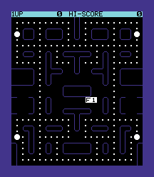

# vic20-recomp — Jelly Monsters, recompiled to native C

**The VIC-20's *Jelly Monsters* (Commodore, 1981) — its 6502 cartridge ROM
statically recompiled to native C on the [`vic20recomp`](../vic20recomp)
toolkit, rendering its maze in full colour.**



*Jelly Monsters* is Commodore's VIC-20 **Pac-Man clone** — and a near-perfect
static-recompilation target. It's an autostart cartridge that, at its cold-start
vector, pokes the VIC chip registers straight from a 16-byte table in its own ROM
(`$A00F → $9000`), copies a custom 8×8 character set into RAM at `$1400`, and
draws its maze into screen RAM (`$1C00`) and colour RAM (`$9400`). **No KERNAL,
no BASIC, no CHARGEN ROM** is needed to draw the picture — the cartridge sets up
the whole machine itself. So the recompiled C reproduces the attract maze
pixel-for-pixel.

> **No ROM data here.** The cartridge is `.gitignore`d, and so is the generated
> recompiled C (a derivative of the copyrighted ROM). Bring your own dump that
> you legally own — see [extraction](#1-get-the-cartridge) below.

## What renders

The screenshot above is a **216×248 colour frame** read straight out of VIC RAM
after the cartridge boots: the blue maze, the white dots and four power pellets,
the cyan `1UP / HI-SCORE` header, the centred start prompt, and the blue border —
exactly the VIC register configuration the cart writes (`bg=black`, `border=blue`,
custom charset at `$1400`, screen `$1C00`, 23×27 cells).

The interpreter run and the fully-recompiled run produce a **byte-identical**
frame; the recompiled image is the oracle's twin.

## Status

- ✅ **Boots from the cartridge cold-start vector** (`$A01F`) on the flat VIC-20
  memory model — no system ROMs required.
- ✅ **562 basic blocks recompiled** to native C functions (`vic_func_<addr>`),
  discovered by recursive descent from the cold-start seed.
- ✅ **Runs ~100% as recompiled code** — a 5,000,000-dispatch run is **0
  interpreted fallbacks, 0 unhandled opcodes**; the interpreter is present only
  as the discovery-gap safety net.
- ✅ **Renders the attract maze in full colour**, identical to the interpreter.
- 🚧 **Gameplay** — the 60 Hz VIA-timer IRQ and the keyboard/joystick matrix
  aren't modelled yet (a static frame render needs neither).
- 🚧 **Live SDL window + sound.**

## Build & run

### 0. Build

```powershell
cmake -S . -B build -G "Visual Studio 17 2022" -A x64 `
      -DVIC20RECOMP_DIR=D:/recomp/computers/vic20recomp
cmake --build build --config Release
```

(The `'pwsh.exe' is not recognized` line in the build output is harmless.)

### 1. Get the cartridge

Bring your own *Jelly Monsters* `[A000]` `.crt` (e.g. from a TOSEC "Commodore
VIC20" set you own). The helper pulls it out of the collection into `roms/`:

```powershell
./scripts/extract.ps1 -Zip "Z:\Roms\...\TOSEC...VIC20....zip"
# or, if you already have the .crt:
./scripts/extract.ps1 -Crt "C:\carts\Jelly Monsters.crt"
```

### 2. Run it (interpreter — the bring-up oracle)

```powershell
./build/games/jellymonsters/Release/jellymonsters.exe roms/jellymonsters.crt 5000000 `
    --shot maze.bmp --calls seeds.txt
```

This boots the cart, draws the maze, prints an ASCII view of screen RAM, writes a
colour BMP, and captures `JSR`-target seeds for recompilation.

### 3. Recompile to native C

```powershell
$M = "build/vic20recomp_build/tools/m6502recomp/Release/m6502recomp.exe"
# the cart minus its 2-byte $A000 header is the raw image; or pass the .crt body
& $M recompbin cart.a000 0xA000 games/jellymonsters/generated 0xA01F `
     --seeds seeds.txt --code 0xA000 0xBFFF
```

### 4. Rebuild with the recompiled image and run it as native code

```powershell
cmake -S . -B build -A x64 -DVIC20RECOMP_DIR=D:/recomp/computers/vic20recomp `
      -DJELLYMONSTERS_HAVE_RECOMP=ON
cmake --build build --config Release
$env:VIC_HYBRID = "1"
./build/games/jellymonsters/Release/jellymonsters.exe roms/jellymonsters.crt 5000000 --shot maze.bmp
```

## How it boots

```
.crt ─► strip 2-byte $A000 load-address header ─► 8K ROM at $A000-$BFFF
      ─► RTS-fill $C000-$FFFF + VIC register defaults
      ─► PC = read16($A000) = $A01F  (cold-start vector)
      ─► run: the cart pokes $9000-$900F, builds its charset at $1400,
              and draws the maze to $1C00 / colour $9400
      ─► vic20recomp's video readout reconstructs the colour frame from RAM
```

## Repository layout

```
games/jellymonsters/src/host.c   load cart, boot, run (interp + recompiled), dump
games/jellymonsters/generated/   recompiled C (regenerated locally; .gitignore'd)
scripts/extract.ps1              pull the cartridge out of a collection you own
screenshots/                     the colour render (committed)
```

## Credits

All host/runtime code is original, on the `vic20recomp` 6502 toolkit. *Jelly
Monsters* is © 1981 Commodore; **no ROM data ships here** — supply your own.

## License

MIT — see [`LICENSE`](LICENSE). Independent, non-commercial preservation work.
